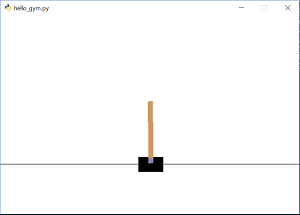

# Tech Circle OpenAI Gym Handson

Tech-Circle #18 「Pythonではじめる強化学習 OpenAI Gym 体験ハンズオン」のハンズオン資料です。

## Setup

事前準備としてOpenAI GymとChainerをインストールします(Chainerは、DQNのサンプルを実行するのに必要です)。  
Windowsの場合、atariのゲームを動かす環境の構築(手順5以降)はネイティブでは非常に困難です。そのため、以下を参考にbash on Windows環境を構築し、bash環境(=Ubuntu環境)で環境構築を行ってください。

[Bash on Ubuntu on Windowsをインストールしてみよう！](http://qiita.com/Aruneko/items/c79810b0b015bebf30bb)

また、bash on Windows側から画面を描写するのに[vcXsrv](https://sourceforge.net/projects/vcxsrv/)か[Xming](https://sourceforge.net/projects/xming/)のインストールが必要です。
インストールするのは新しいvcXsrvのほうが良いですが、動かないケースが報告されているのでその場合はXmingを試してみてください。
これらをインストールしServerを起動すると、スクリーンが立ち上がります。bash側で`export DISPLAY=:0`を行い出力先をこのスクリーンに設定することで、実行結果を確認できます(`.bashrc`に書いておくと実行し忘れを防げます)。

1. Pythonのインストール  
Pythonは3を利用します。[こちら](http://qiita.com/icoxfog417/items/e8f97a6acad07903b5b0#python%E3%81%AE%E3%82%BB%E3%83%83%E3%83%88%E3%82%A2%E3%83%83%E3%83%97)などを参考に、Pythonのインストールを行ってください。
なお、bash on Windowsを利用している場合Linuxベースの環境構築となります(中身はUbuntuのため)。
Windows側でPythonがインストールされていてもそれはbash環境とは別個なので、仮にWindows側でPythonをインストールしていてもbash側でもインストールを行う必要がある点に注意してください。
2. リポジトリのfork/clone  
本リポジトリをforkし、cloneしてください(良ければStarもよろしくですm(_ _)m)。以後、cloneしたフォルダ(`techcircle_openai_handson`)の中で作業をしていきます。
3. OpenAI Gymのインストール  
`pip install gym`でOKです。なお、インストールは`virtualenv`や`conda`を使い、仮想環境にインストールすることをお勧めします。仮想環境の作成についての詳細は、上記のリンク先の資料をご参照ください。
4. Gymの動作確認  
    本リポジトリの中にある`confirm_hello_gym.py`を実行し動くかどうかを確認してください。  

    ```
    python confirm_hello_gym.py
    ```

    上手くインストールできていれば、以下のようにCartPoleが動くはずです。特にWindowsで環境構築を行っている場合は、まずここで実行を確認しておいてください。
    
    
5. 依存モジュールのインストール  
ここから、gymでatariのゲームが扱えるよう追加のインストールを行っていきます。[公式ページ](https://github.com/openai/gym#installing-everything)に記載の通り、atari環境を実行するのに必要なライブラリなどをインストールします。
6. atari環境のインストール  
`pip install 'gym[atari]'` でインストールを行います
7. Chainerのインストール  
`pip install chainer`でインストールします
8. atariの動作確認  
     本リポジトリの、`confirm_dqn_env.py`を実行し動くかどうか確認してください。

    ```
    python confirm_dqn_env.py
    ```

    


これで準備は完了です。お疲れさまでした！


## 1. AI follow the Rules(15min)

まずは、ルールでAIを作ってみます。`handson1_rule_ai.py`を実行してみてください。

```
python handson1_rule_ai.py
```

現在、上下に動くふんふんディフェンスが実装されています。そして圧倒的に負けていると思います。  
このエージェントの実装は、`agents/rule_defender.py`で行われています。具体的に行動計画を決めているのは、`act`のメソッドです。

```
    def act(self, observation):
        if len(self._plan) == 0:
            self._plan += [self.action_up] * self._interval  # up
            self._plan += [self.action_down] * (self._interval * 2)  # back to center & down
            self._plan += [self.action_up] * self._interval  # back to center
        
        return self._plan.pop(0)
```

これを修正し、せめて1点ぐらいは返せるようにしてみてください。`observation_to_state`のメソッドで、各オブジェクトの座標をとれるようにしているので、適宜利用してください。
なお、相手のコンピューターはめっちゃ強いです。勝利を収めた人はいち早く報告してください。拍手でほめたたえましょう！


## 2. AI learn by Q-learning(15min)

次に、Q-learningを利用して自分で学習をするようにします。Pongではちょっと複雑なので、ここではCartPoleを利用します。  
最初に、`handson2_q_qi.py`を実行してみてください。

```
python handson2_q_qi.py  --render
```

全然安定していないと思います。なお、クリアラインは200stepsキープです。  
実際、Q-learningの実装を行うのはそれほど大変ではありませんが、学習させるのはとても大変です。
`handson2_q_qi.py`では様々なパラメーターが設定されているので、それをチューニングして結果がどう変わるのか見てみてください。

* Q関数
 * bin_size: Cartの位置を離散値にするための幅(ヒストグラムを作るときの幅と同じようなものです)
 * low_bound/high_bound: 観測情報の下限・上限の値
* エージェント
 * epsilon: 探索/活用の割合を決める値
* 学習
 * learning_rate: 初期学習率
 * learning_decay: 学習率の減らし方。最初は荒く探して、あとは細かく探すのがセオリー
 * epsilon: 初期epsilon
 * epsilon_decay: 探索率の下げ方。最初はランダムに実行して(epsilonは大きな値)、経験が蓄積してきたら活用するのがセオリー
 * gamma: 報酬の割引率
 * max_step: ステップ数の上限。ここまでPoleをキープ出来たら、打ち切る

なお、パラメーターのチューニングだけで250stepに到達することが可能です。チャレンジしてみましょう！


## 3. AI learn by Deep Q-learning

はじめに、以下のリポジトリをcloneしてください。

[chainer_pong](https://github.com/icoxfog417/chainer_pong)

cloneしたディレクトリに移って、実行をしてみてください。

```
python run.py
```

こちらは、学習に時間がかかるためすぐには結果は出ません。そのため、実装・チューニングのポイントを説明しますので講義を聞いていただければと思います。  
良い結果が出たら、ぜひOpenAI Gymにアップロードしてみてください！

