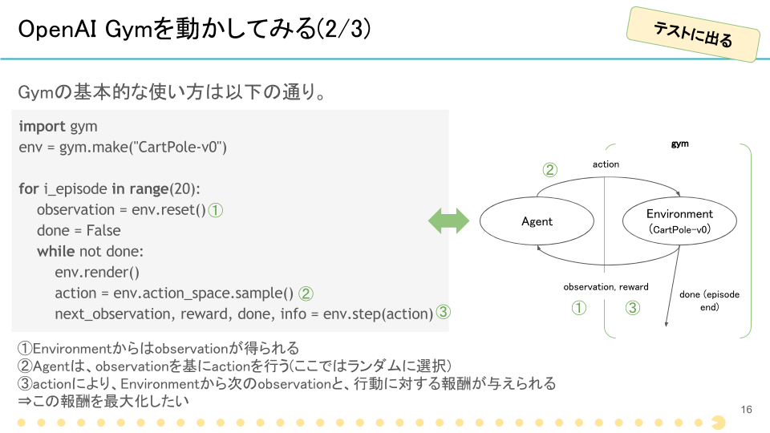

# Let's Start OpenAI Gym

まず、OpenAI Gymを使って学習環境を動かしてみましょう。

講義編の、「OpenAI Gymを動かしてみる」を参照してください。



編集するファイルは、`handson1.py`です。`handson1.py`の`main`関数を、以下のように編集してください。

```python
def main(env_name, episode_count):
    env = gym.make(env_name)

    for i in range(episode_count):
        observation = env.reset()
        done = False
        score = 0

        while not done:
            env.render()
            action = env.action_space.sample()
            next_observation, reward, done, info = env.step(action)

            observation = next_observation
            score += reward

            if done:
                print("Episode {} is end. score={}".format(i, score))

```

編集が完了したら、実行してみてください。

* virtualenvなどで仮想環境を利用している場合は、有効化を忘れずに行ってください
* Windowsの場合は、VcXsrv/Xmingの起動を忘れずに行ってください
* コマンドは、`handson_1`のディレクトリに移動したうえで実行してください

```
python handson1.py
```

このスクリプトは、引数で環境の種類とエピソード数を渡せるようになっています。

* `--env`: 環境の種類を設定する。用意されている環境の種類は、[Environment](https://gym.openai.com/envs)を参照してください
* `--episode`: 実行するエピソード数(1エピソード=ゲームの開始～終了)

これらの引数を変更して、デフォルトとは異なる環境を動かしてみてください。以下は、その一例になります。

```
python handson1.py --env AirRaid-ram-v0 --episode 5
```

`print`文を使うことで、観測されている`observation`を出力することができます。  
`env.step`を実行している行の下に、以下のようにprint文を追加してみてください。

```python
            next_observation, reward, done, info = env.step(action)
            print(next_observation)

```

これにより、actionを実行したことによって変化したstate(=next_observation)が毎回出力されます。  
環境を切り替えると、観測されているobservationも変化することが確認できると思います。

[handson1.py answer](https://github.com/icoxfog417/techcircle_openai_handson/blob/answer/handson_1/handson1.py)
