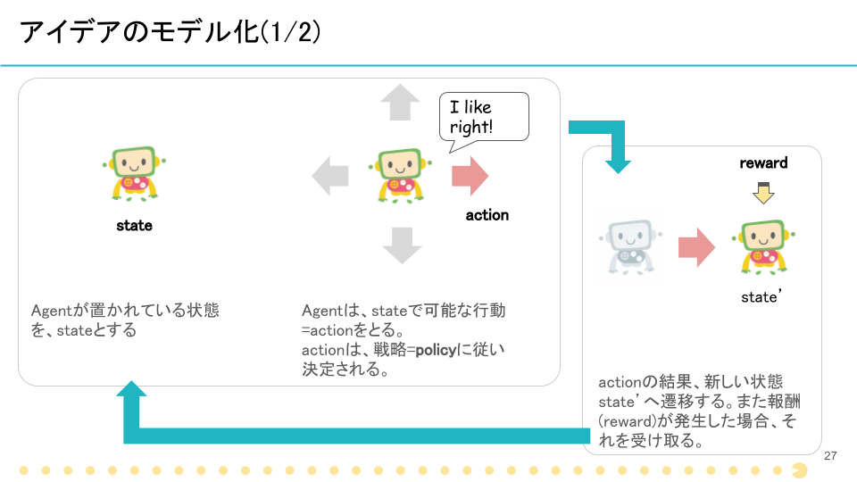

# Deploy Agent to Environment

学習環境の中に、行動を行うAgentを配置してみます。

* 環境から状態を観測する
* 観測した状態を基に行動する
* 行動の結果、次の環境に遷移する。報酬が発生した場合それを得る

この一連のプロセスを体感してみましょう。

今回用意しているエージェントは、以下の3種類です。

* `Random Agent`: 完全にランダムに行動するAgent
* `FunFun Agent`: フンフンディフェンスを行うAgent
* `Track Agent`: ボールを追いかけるAgent

これらのエージェントを切り替えながら、その挙動を確認してみてください。  
コードを実装するのは、`handson2.py`の`your code here`と書かれいている個所(16行目)になります。

各エージェントの実装コードは以下の通りです。

* `agent = RandomAgent(action_number)`
* `agent = FunFunAgent(action_up, action_down, action_stop)`
* `agent = TrackAgent(action_up, action_down, action_stop)`

これらのコードを、実装する箇所に書いてみてください。  
そして、挙動の違いを確認してください。

もちろん、自分なりのルールに基づいたエージェントを実装してみていただいてもかまいません。

