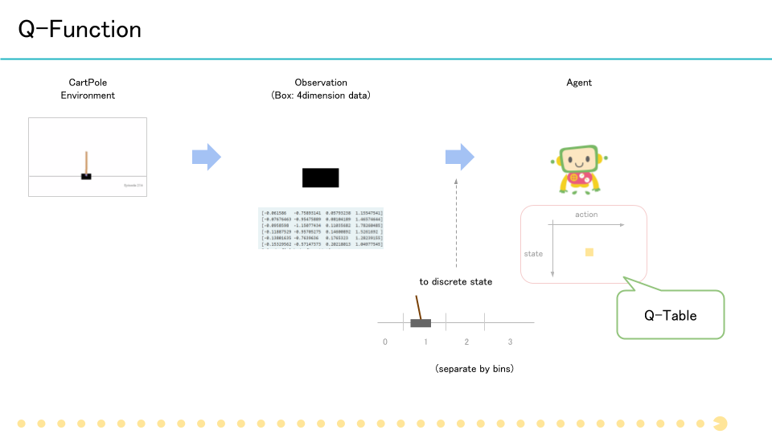
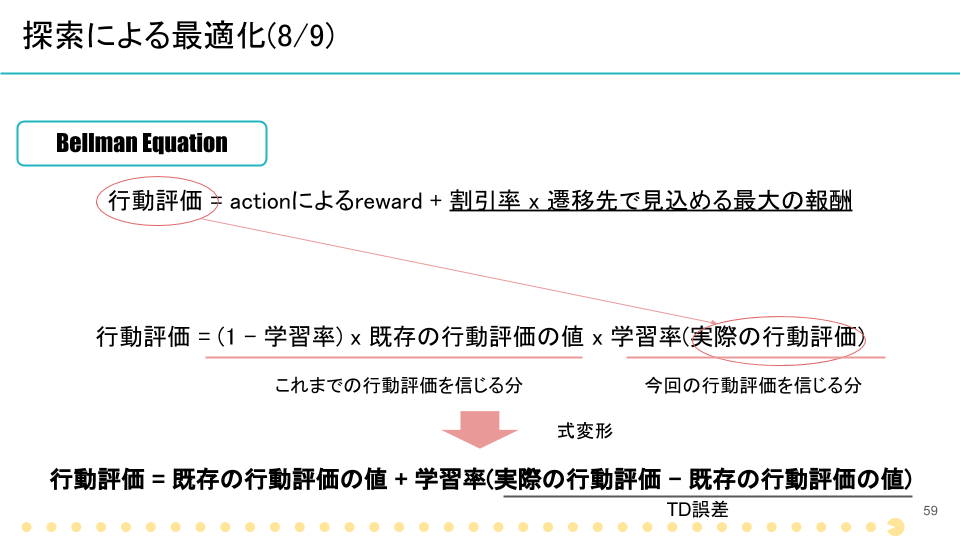

# Train Agent by Reward

今までのAgentは固定されたルールに基づいて行動をとっていましたが、ここではいよいよ強化学習を用いて学習させてみます。  
学習に使用するアルゴリズムは、Q-learningです。

学習に対象の環境は`CartPole-v0`とします。この環境での目的は、カートをうまく動かして棒がなるべく長い時間倒れないようにすることです。


赤で囲った個所の、step数(=棒をキープ出来た期間)がなるべく大きくなるように、カートの動かし方を学習させます。  
※倒れた瞬間に次のエピソードに行くのであたかもずっと立っているかのように見えるかもしれませんが、エピソードが切り替わっていたらそれは死んでいるということです。

## Q-function (q.py)

はじめに、Agentの行動を評価する関数であるQ-functionを作成します。  
「行動を評価する関数」とは、具体的には「ある状態の時、どんな行動が、どれぐらいいいか」を計算するものです(出力される行動評価の値は、Q-valueと呼ばれます)。
これが上手く学習できれば、評価が最も高い行動=最適な行動となります。

今回はこの関数を実装するにあたり、簡単な実装であるQ-tableを利用します。

Q-tableは、縦軸に状態、横軸に行動をとり、中の値が行動評価(Q-value)であるクロス表のイメージになります。  
「クロス表」にまとめるために、Q-tableを利用するときは状態と行動がどちらも離散的である必要があります。
ただ、今回のCartPoleは、その位置が連続的な値なので、これを区間に分けて離散的な値で表現することにします。

少し難しくなりましたが、イメージは以下の図のようになります。



CartPoleの位置が、0,1,2といった離散的な値になっているのがわかると思います(※)。  
Q-tableは、「位置が2の時に行動3を取ったときの行動評価は、0.1」というような感じで値を保持します。

この実装は少し難しくなるので、今回はすでに用意したコードを作成します。

実装は`handson_3/q.py`の中にあるので、興味がある方は参照してみてください。  
[`Q.values`関数](https://github.com/icoxfog417/techcircle_openai_handson/blob/answer/handson_3/q.py#L55)によって、引数によって与えた`observation`における各アクション評価値を取り出すことができます。コード上で押さえておくべき点は、とりあえずこれだけです。

※CartPoleの状態はBoxという箱の四隅?の位置がセットになったもので渡されるため、これら4つの値を離散値にして、なおかつ表形式で表現できるよう一つの値にする必要があります。コード中では、この処理を`observation_to_state`で行っています。

## Agent (agent.py)

続いて、このQ-functionを基に行動するAgentを実装します。

Q-learningを使用する場合、Agentには探索と活用のジレンマがありました。


要は、探索のためにランダムで行動すべきか、活用のため自分で学習したQ-functionを信じて行動するか、ということです。  
このトレードオフを表現したものがε-greedy法です。具体的には、εの確率でランダムに、1-εの確率で自分を信じて行動します。

このε-greedy法を、Agentに実装しましょう。`agent.py`の中の`act`関数を、以下のように編集してください。

```python
    def act(self, observation):
        # your code here
        action = -1
        if np.random.random() < self.epsilon:
            action = np.random.choice(self.q.n_actions)
        else:
            action = np.argmax(self.q.values(observation))
        
        return action

```

* 乱数を発生させepsilon以下である場合(つまり、epsilonの確率で)、ランダムに行動します(=探索)
* epsilon以外の時は、これまでの学習結果を利用して行動を決定します(活用)
 * 先ほど定義した`Q.values`関数から得られる行動評価の中で最大のものをactionとして採用しています(argmaxは、値が最大のもののインデックスを取る関数です)。

これで、Agentの実装は終了です。

しかし、このままではなにも学習しないのでずっと賢くないままです。そこで、このAgentを学習させるコードを実装します。

[agent.py answer](https://github.com/icoxfog417/techcircle_openai_handson/blob/answer/handson_3/agent.py)

## Trainer (trainer.py)

Agentを学習させるTrainerを実装します。

Agentの行動を決定するQ-functionは、どう更新すればよかったでしょうか?  
Q-learningを思い返してみましょう。



計算に必要な主な要素は、以下でした。

* 既存の行動評価の値
* 実際の行動評価
 * actionによるreward
 * 遷移先で見込める最大の報酬

これを基に、[`trainer.py`の`your code here 1`と書かれた箇所](https://github.com/icoxfog417/techcircle_openai_handson/blob/master/handson_3/trainer.py#L34)に、以下のコードを追加します。

```python
                future = 0 if done else np.max(self.agent.q.values(next_obs))
                value = self.agent.q.table[state][action]
                self.agent.q.table[state][action] += lr * (reward + self.gamma * future - value)
```

実際のコードとの対応は、以下のようになっています。

* 既存の行動評価の値 = `value`
* 実際の行動評価
 * actionによるreward = `reward`
 * 遷移先で見込める最大の報酬 = `future` (遷移先である`next_obs`における最大の行動評価)

なお、`lr`は学習率、`gamma`は割引率となります。このように、更新については本当に実際の定義通り実装されているのがわかると思います。


そして、学習に際してはもう一つ重要なことがありました。それは、学習が進むにつれて探索の割合、また学習率を徐々に減らしていくということです。
今回は、「減らし方」を外部から受け取るようにしています。そのため、エピソードが終了した段階で、受け取った減らし方の通りにパラメーターを調整します。

[`trainer.py`の`your code here 2`と書かれた箇所](https://github.com/icoxfog417/techcircle_openai_handson/blob/master/handson_3/trainer.py#L49)に、以下のコードを追加してください。


```python
                if self.epsilon_decay is not None:
                    self.agent.epsilon = self.epsilon_decay(self.agent.epsilon, i)
                if self.learning_rate_decay is not None:
                    lr = self.learning_rate_decay(lr, i)

```

これで学習の準備は整いました！

最後に、以下のコマンドを実行して学習がきちんと進んでいるか、確認してみてください。

```
python handson3.py --render
```

しばらくたつと、ポールをキープする時間が長くなっていくのがわかると思います。

[trainer.py answer](https://github.com/icoxfog417/techcircle_openai_handson/blob/answer/handson_3/trainer.py)

**[Go To Next: Submit Your Agent to OpenAI Gym](https://github.com/icoxfog417/techcircle_openai_handson/tree/master/handson_optional)**
